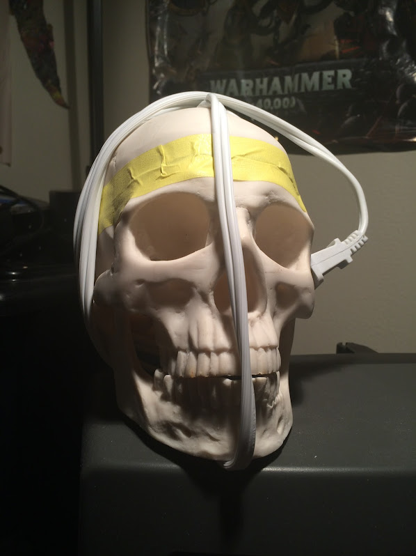

# Chess-Skull-Web
A less mature version of my skully chess opponent that uses Speech-to-text and tex-to-speech, byt has a simpler AI and runs on a webpage
See https://github.com/necarlson97/chess-cube for the more mature version of a simmilar project.

